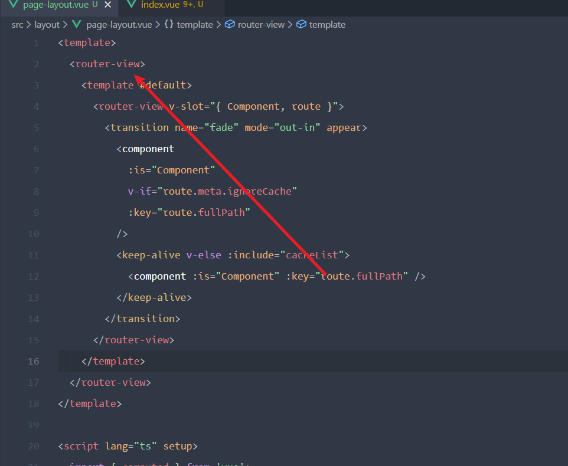

# 使用的技术栈

> vite+vueRouter+pinia+arcoDesign  
> 依赖下载工具pnpm

# 修改"@"路径名

- 安装依赖

```cmd
pnpm i @types/node -D
```

- 修改vite.config.js

```js
import { defineConfig } from 'vite'
import vue from '@vitejs/plugin-vue'
import {resolve} from 'path';
// https://vitejs.dev/config/

export default defineConfig({
  plugins: [vue()],
  resolve: {
    alias: [
      {
        find: '@',
        replacement:resolve(__dirname,'src')
      }
    ]
  },

})

```

- 修改tsconfig.json

```json
{
    "compilerOptions" : {
        // ...
        "baseUrl": ".", // 用于设置解析非相对模块名称的基本目录，相对模块不会受到baseUrl的影响
        "paths": { // 用于设置模块名到基于baseUrl的路径映射
            "@/*": ["src/*"]
        }
        // ...
    }
}
```

# Day 2

## 第一个问题,如果通过Slots来控制content内容

---

知识点

- 使用setup语法以后,可以不用导出component 可以直接使用
- `<router-view/>`被用在layout中
- v-slot可以用来自定义插槽内容



### `<Slot>插槽学习`

```javascript
<FrancyButton>
  // 插槽内容
  Clik me!
</FrancyButton>


// 这个组件的模板是

<button>
  <slot></slot>
</button>
```

slot是插口,表示父元素的插槽内容将在哪里被渲染.

插槽中可以放默认值,意味着,当插槽中没有值的时候,可以有默认值,类似于,emmm,`<Empty/>`?
# Error getActive Pinia was called with no active Pinia. Did you forget to install pinia?


- main.ts
```js
import { createApp } from 'vue'
import App from './App.vue'
import router from '@/router';
import ArcoVue from '@arco-design/web-vue';
import '@arco-design/web-vue/dist/arco.css';
import { createPinia } from 'pinia';
const pinia = createPinia();
const app = createApp(App);
app.use(pinia);
app.use(router);
app.use(ArcoVue);
router.isReady().then(() => {
  app.mount('#app')
})
```
> 这里报错是因为,再页面挂载之前就已经开始调用了它的store了,所以需要将`store`延后
> 大概是这么理解的....

- stores
  - home.ts 
 
```ts 
import { defineStore } from 'pinia';

export const useHomeStore = defineStore({
  id: 'home',
  state: () => ({
    count:0,
  }),
  actions: {
    increment() {
      this.count++
    }
  }
})
```

## component-组建基础

以`.vue`结尾的文件，通常会被叫做单文件组件(简称SFC)
```ts
<script setup lang="ts">
import { ref } from 'vue'

const count = ref(0)
</script>

<template>
  <button @click="count++">You clicked me {{ count }} times.</button>
</template>
```

使用组件和vue差不多，如果是setup语法，就直接导入使用就行,两种写法
```js
<template>
  <xxx></xxx>
  <xxx />
</template>
<script setup>
import xxx from 'xxx/xxx/xxx'
</script>
```

### slot插槽语法
这个可以直接去`@/components/School.vue`里面看，大概意思就是当你在使用代码的时候，如果不是闭合标签，那么标签内部的内容啥的，会直接在slot地方展示，类似于`react`里面`children`.

> **提到组件，就不得不提到props，传递数据**

在vue中，定义props的几种方法
```js
// 直接定义props
const props = defineProps(['xxx','xxx','xx'])
// ts定义数据类型
const props = defineProps({
  name: String,
  age: Number,
  sex: String,
})
```
